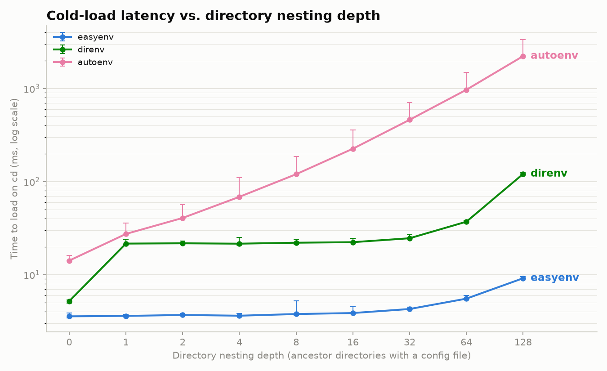

# easyenv

**easyenv** loads a directory's `.env` file into your shell the moment you `cd` into it, and unloads it the moment you `cd` back out. That's the whole feature.

```console
$ cd ~/projects/api
$ echo $DATABASE_URL
postgres://localhost/api_dev

$ cd ~/projects/frontend
$ echo $DATABASE_URL

```

No `.envrc`, no `direnv allow`, no per-directory trust prompts, no leftover variables from the last project you were in. You install it once and forget it's there.

```console
$ curl -fsSL https://raw.githubusercontent.com/Chris1221/easyenv/main/install.sh | bash
```

Detects your platform, downloads and checksum-verifies the right release binary, installs it to `~/.local/bin` (no `sudo`), and asks before touching your shell's rc file. Full details: [Installation](getting-started/installation.md).

## It stays fast, even deep in a directory tree



That's cold-load latency — the time from `cd` to variables being set — as nesting gets deeper, benchmarked against direnv, autoenv, [shadowenv](https://github.com/Shopify/shadowenv), [mise](https://mise.jdx.dev/), and [zsh-autoenv](https://github.com/Tarrasch/zsh-autoenv). easyenv and shadowenv (also Rust, also diff/reversal-based) stay at a few milliseconds out to 128 nested directories. direnv grows moderately. autoenv, mise, and zsh-autoenv all grow sharply with depth — mise passes **2 seconds** at 128 levels. Full methodology, caveats, and how to reproduce it: [Benchmarks](reference/benchmarks.md).

## How it compares

Against direnv, autoenv, and the three other tools this project benchmarks itself against ([shadowenv](https://github.com/Shopify/shadowenv) from Shopify, [mise](https://mise.jdx.dev/) from jdx, and [zsh-autoenv](https://github.com/Tarrasch/zsh-autoenv)):

| | **easyenv** | [direnv](https://direnv.net/) | [autoenv](https://github.com/hyperupcall/autoenv) | [shadowenv](https://github.com/Shopify/shadowenv) | [mise](https://mise.jdx.dev/) | [zsh-autoenv](https://github.com/Tarrasch/zsh-autoenv) | sourcing `.env` by hand |
|---|---|---|---|---|---|---|---|
| Loads `.env` automatically, no boilerplate | ✅ | ❌ — needs an `.envrc` that explicitly calls `dotenv` | ✅ | ❌ — config is Shadowlisp (`.shadowenv.d/*.lisp`), not `.env` | ❌ — needs `mise.toml` (can `_.source` a `.env`, but still needs the config file) | ❌ — config is `.autoenv.zsh`, an actual zsh script | ❌ |
| Unloads automatically on `cd` out | ✅ | ✅ | ❌ — needs `.env.leave` + opt-in | ✅ | ✅ | ✅ | ❌ |
| No per-directory trust/allow step | ✅ | ❌ — requires `direnv allow` the first time (and again on every edit) | ❌ — prompts interactively the first time a `.env` is new or changed (bypassable via `AUTOENV_ASSUME_YES`) | ❌ — requires `shadowenv trust` | ❌ — requires `mise trust` (auto-trusted in detected CI by default) | ❌ — same whitelist-prompt model as autoenv | n/a |
| What a hostile `.env` in a cloned repo can do | set inert variables only — [~150 dangerous names denied by default](reference/security.md) | nothing, without an explicit `direnv allow` | nothing until authorized — but once authorized, arbitrary shell, no further restriction | nothing, without an explicit `shadowenv trust` | nothing, without an explicit `mise trust` | nothing until authorized — same all-or-nothing model as autoenv | whatever the file contains — no different from running any other script |
| Parent directories merge automatically, child overrides parent | ✅ | only via an explicit `source_up` call in every child `.envrc` | ✅ | ❌ — needs an explicit `.shadowenv.d/parent` symlink in every directory | ✅ | ❌ — needs an explicit `autoenv_source_parent` call in every file | ❌ |
| Zero configuration files | ✅ | ❌ (`.envrc` per directory) | ✅ | ❌ (`.shadowenv.d/`) | ❌ (`mise.toml`) | ❌ (`.autoenv.zsh`) | n/a |
| Runtime | single Rust binary | Go binary | Bash script | Rust binary | Rust binary (also a version manager + task runner) | Zsh script | — |

The short version: direnv is powerful and general (it can run arbitrary shell, not just `.env` files) but that generality is exactly why it needs an explicit `.envrc` and a trust step per directory — friction easyenv is designed to have none of. autoenv gets the "load on `cd` in" half right, including automatic parent/child merging, but doesn't unload without extra setup, so variables from one project bleed into the next. shadowenv (also Rust, also a diff/reversal design) and mise both require an explicit trust step too, closer in spirit to direnv here than to easyenv; neither shadowenv nor zsh-autoenv merge parent directories automatically the way easyenv/mise/autoenv do — each needs an explicit per-directory opt-in to inherit anything from above. zsh-autoenv fixes plain autoenv's biggest complaint (no unload) but keeps the same authorization-prompt model. easyenv only does the one job — load/unload `.env` on `cd`, with nested overrides — and does it with no config and no prompts. "No trust step" is a fair usability win only because it's backed by an actual enforcement mechanism, not just an absence of prompts — see [Security](reference/security.md) for what that mechanism is and its honest limits, and [Benchmarks](reference/benchmarks.md) for how these tools compare at deep nesting.

## How it merges nested directories

If a parent directory also has a `.env`, easyenv loads that too — the child directory's values win on conflicting keys, but everything else from the parent is still there:

```console
$ cat ~/projects/.env
LOG_LEVEL=info

$ cat ~/projects/api/.env
DATABASE_URL=postgres://localhost/api_dev

$ cd ~/projects/api
$ echo $LOG_LEVEL $DATABASE_URL
info postgres://localhost/api_dev
```

Leaving `api/` and returning to `projects/` restores `DATABASE_URL` to whatever it was before (unset, in this case) while keeping `LOG_LEVEL` loaded.

!!! note "Keep secrets out of ancestor `.env` files"
    A parent directory's `.env` is inherited by *every* descendant, including repos you clone just to look at — that's why the example above uses `LOG_LEVEL`, not a token. See [Security](reference/security.md) for the fuller picture.

## Where to go next

- [Installation](getting-started/installation.md) — build the binary and wire up your shell
- [Quickstart](getting-started/quickstart.md) — five-minute walkthrough
- [Tutorials](tutorials/nested-directories.md) — nested `.env` precedence and live edits
- [How it works](reference/how-it-works.md) — the shell-hook + diff/state design under the hood
- [Security](reference/security.md) — the trust model, what's denied by default, and what to be careful of
